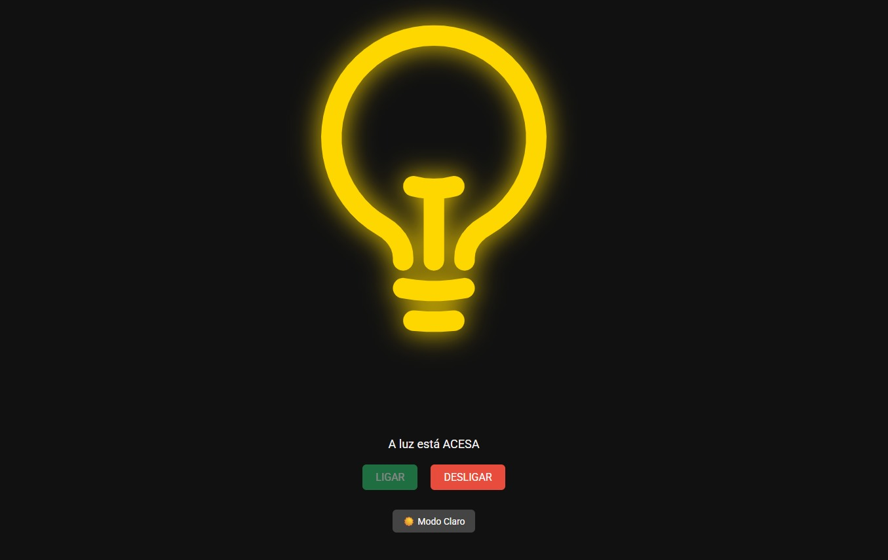
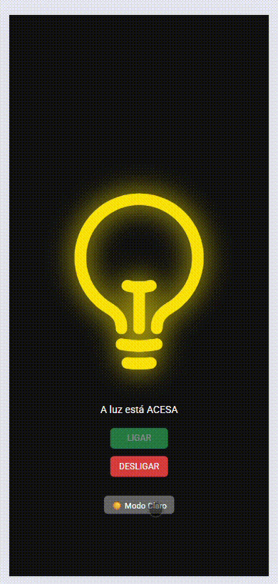

## 🔗 Projeto online

👉 [smart-light-switch.vercel.app](https://smart-light-switch.vercel.app/)





```
# 💡 Smart Light Switch

Projeto React para treinar fundamentos do front-end, com foco em lógica, estado e estilização moderna.

## 🚀 Funcionalidades
- Ligar e desligar uma lâmpada virtual
- Modo escuro / modo claro
- Ícone animado com styled-components
- Armazenamento do estado no localStorage   
- Design responsivo para mobile
- Interface acessível e amigável

## 🧠 Tecnologias aplicadas
- React (useState, useEffect)
- Styled-components
- React Icons
- LocalStorage
- Vite

## 📸 Demonstração
🔗 https://smart-light-switch.vercel.app/

```bash

## 📁 Estrutura de pastas
smart-light-switch/
├── assets/
│ └── banner.png
├── node_modules/
├── public/
├── src/
│ ├── components/
│ │ └── LightSwitch.jsx
│ ├── styles/
│ │ └── styles.js
│ ├── main.jsx
│ └── App.jsx
├── .gitignore
├── package.json
├── package-lock.json
├── README.md
└── vite.config.js

```bash

## 📁 Como rodar o projeto localmente

```bash
git clone https://github.com/analiceferreirads1/smart-light-switch.git
cd smart-light-switch
npm install
npm run dev

```
👩🏾‍💻 Desenvolvido por
Analice Ferreira.
